确认方法适用于<DRP精简版本从0开始v1.1.docx>部署的应用服务器

# 检查应用服务器运行状态
1. 应用服务器是否在同局域网

        ping [应用服务器ip]
    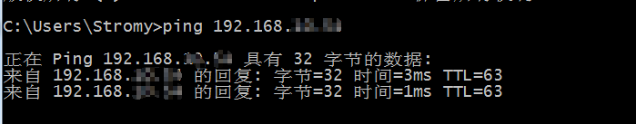

# 检查应用服务器医惠平台运行状态

1. 访问tomcat管理网址确定平台服务运行状态
    > tomcat管理网址:** _http://[应用服务器ip]:8080/manager/html_ **

    登录管理网址
    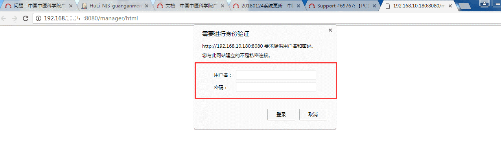
    查看服务运行状态，**红框**
    标记出服务的运行状态
    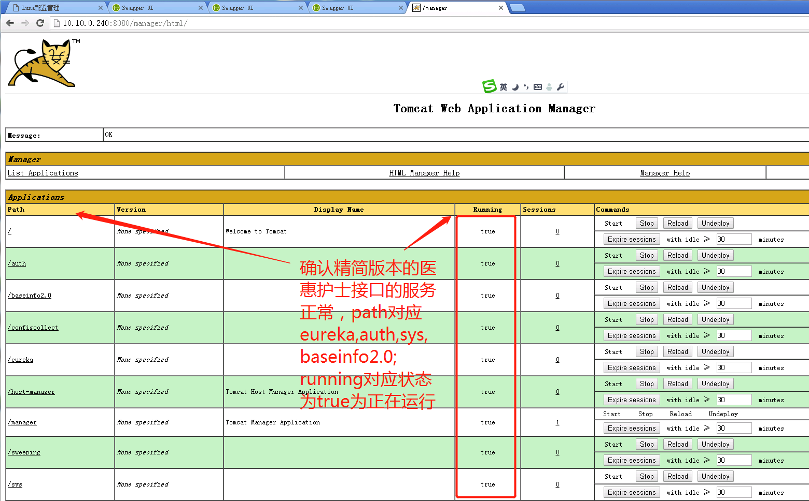
1. 处理异常状态

    异常时，请在command区域尝试重新启动
    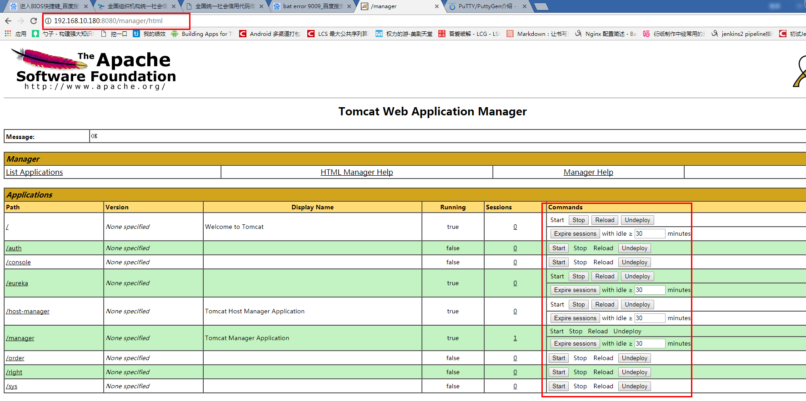
    重新启动尝试失败，请参照下表，从服务器获取日志

    |服务名称|日志位置|日志包含关键字|
    |---|:---|---|
    |auth|[tomcat安装目录]\bin\logs|authority|
    |baseinfo2.0|[tomcat安装目录]\bin\logs|baseinfo|
    |eureka|[tomcat安装目录]\bin\logs|discovery|
    |sys|[tomcat安装目录]\bin\logs|sys|
    |configCollect|[tomcat安装目录]\bin\logs|configCollect|

    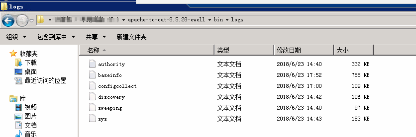

# 检查应用服务器采集服务运行状态

1. 访问tomcat管理网址确定平台服务运行状态
    > tomcat管理网址:_http://[应用服务器ip]:8080/manager/html_

    *确认方法和上面tomcat检查方法一致*

1. 启动异常如何获取日志

    *获取日志位置和上面医惠平台运行状态一致*

    |服务名称|日志位置|日志包含关键字|
    |---|:---|---|
    |configCollect|[tomcat安装目录]\bin\logs|configCollect|

---

# 登录问题分析方法
分析思路:   确认医惠平台服务运行正常 》 确认通过接口登录正常 》 确认通过移动护理客户端登录正常
1. 通过 [检查应用服务器医惠平台运行状态](#检查应用服务器医惠平台运行状态) 检查

1. 确认organcode设置
    1. 确认数据库的organcode

        **oauth数据库T_SYS_USER表的organcode 
        userdb数据库T_SYS_USER表的organcode**

        确认红框部分的*organCode*是否正确，第一个框是**organcode-loginname**的组全，第二个框是**organcode**

        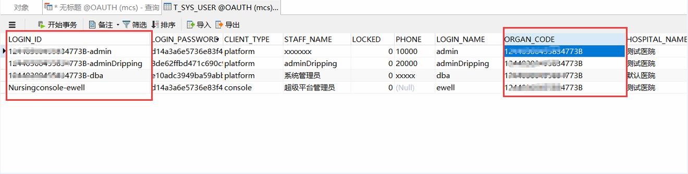

    1. 打开服务配置文件，确认配置文件中的organcode

        找到环境变量EWELL_ENV设置的路径,打开dripping文件夹，查看配置文件

        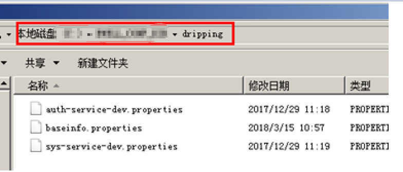

        >auth-service-dev.properties

        检索定位到关键字organCode位置，确认organcode

        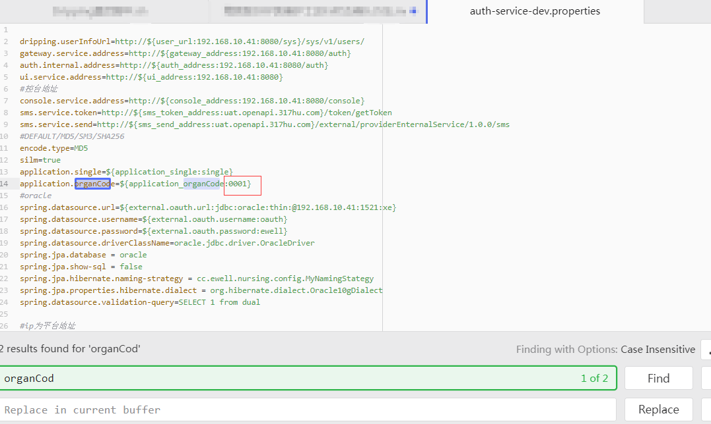

        >sys-service-dev.properties

        检索定位到关键字organCode位置，确认organcode

        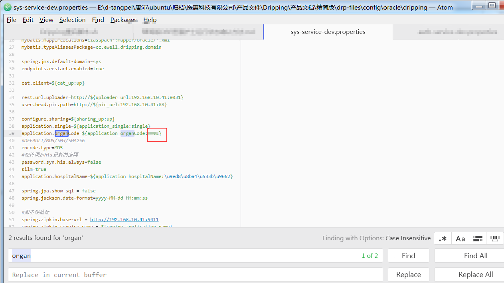

1. 访问登录验证接口，验证登录接口
    1. 访问Auth服务api swagger地址，按框选打开接口页面
        > http://[应用服务器]:8080/auth/swagger-ui.html

        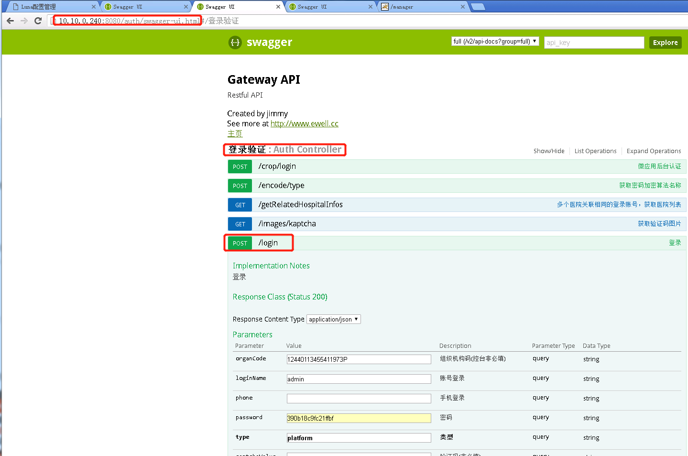
    1. 尝试进行登录(**注意organCode和密码的填写，密码填写需要写加密的密文**)
        > |明文|加密方式|密文|
        > |---|:---|---|
        > |ewell|md5|390b18c9fc21ffbf|
        > |123456|md5|5b4ae7428c86cc1c|

        使用admin用户验证医惠护士账户 
        使用dba用户验证移动护理账户

        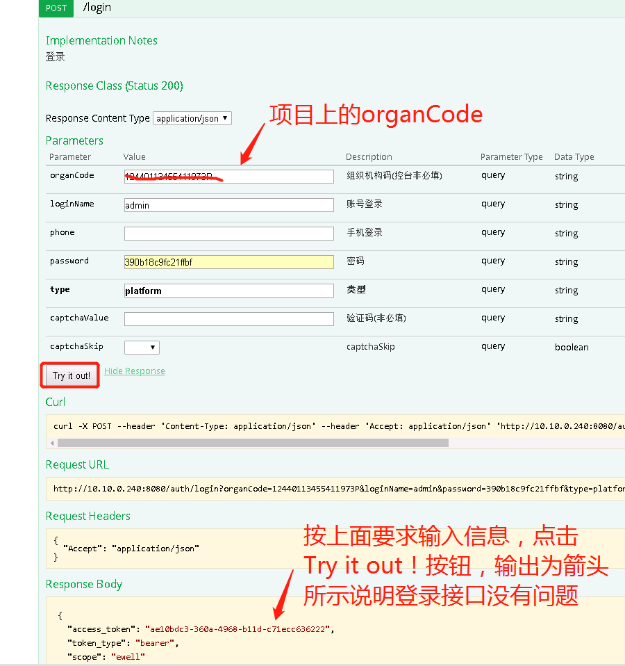

    **结果不符合预期，按[检查应用服务器医惠平台运行状态](#检查应用服务器医惠平台运行状态)提供auth的日志**
1. 确认移动护理配置，验证登录
    1. 移动护理后台服务配置地址

        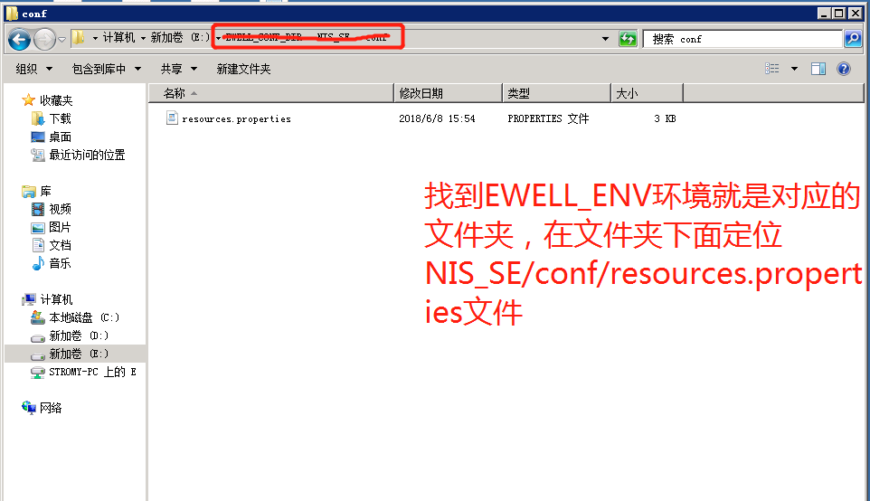

    1. 确认医惠护士地址和organCode填写符合要求

        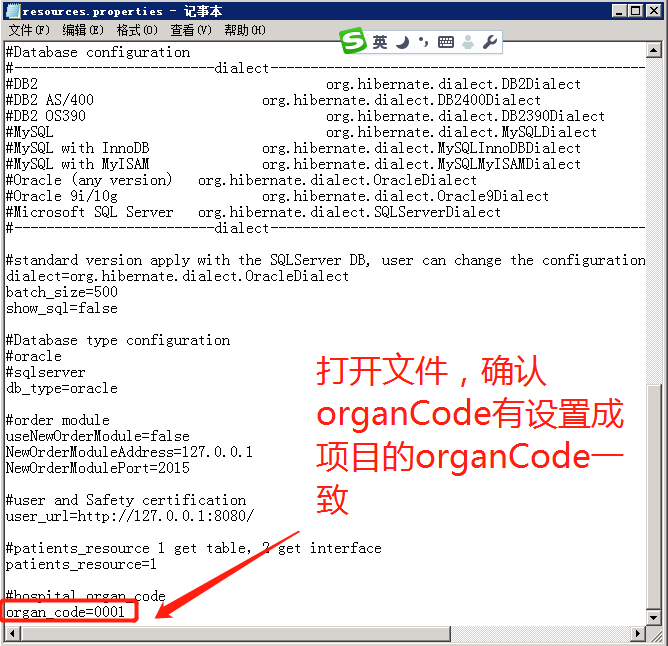

    1. 访问移动客户端验证登录

# 登录问题案例
### 关键字  用户名或密码错误-IncorrectResultSizeDataAccessException

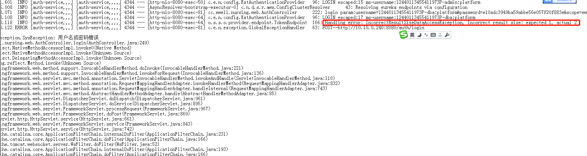

使用登录问题分析方法没有找到原因，联系登录开发人员确定问题原因
OAUTH_ACCESS_TOKEN中同一个用户存在两条记录，删除这两条记录，重新登录尝试，问题修复成功

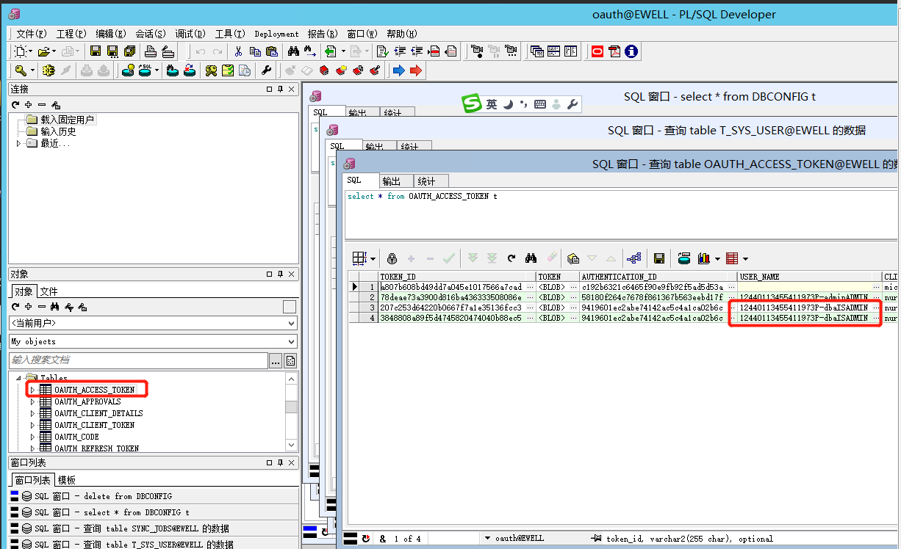

---
### 关键字 internalAutheticationServiceException  dripping.userInfoUrl

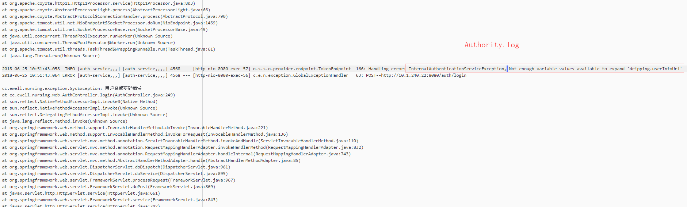

说明和解决方法看下图

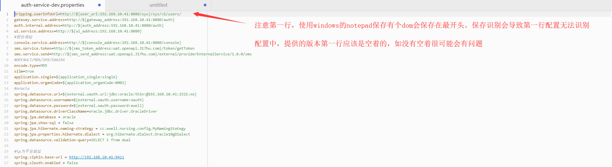
